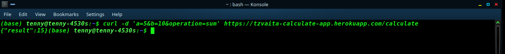

<h1 align="center">
  Calculate - API.
</h1>

<strong>Calculate api</strong> is a Ruby on Rails API only app. Its core functionality is taking in two numbers and doing a mathematical operation on it i.e add, subtract, multiply, and divide. The application does not have a front-end hooked to it and can only be interacted with by using api testing applications like POSTMAN or Curl etc.

**POSTMAN**

  

 Output using postman with values 5 and 5 and a "times" operation

**Curl using bash**

  

 Output using curl with values 5 and 10 and a "sum" operation

### Production Dependencies

| **Dependency**   | **Use**                                              |
| ---------------- | ---------------------------------------------------- |
| Database       | Postgresql |
| Rails       | Rails 6|
| Testing       | Minitest |
| Testing       | Minitest reporters |
| Linters            | Rubocop|
| Deployment       | Heroku         |
|                                |

### Prerequisites

- Postgres
- Npm
- Rails 6+
- Ruby 3.0.0

### Setup

- git clone `git@github.com:tzvaita/calculate-api.git`
- cd calculate-api
- npm install
- bundle install
- rails db:migrate
- rails s
- Once the server is up and running the api is now live on localhost:3000

-Other options to interact with the api end-point is heroku deployment which can be accessed on https://tzvaita-calculate-app.herokuapp.com/calculate

N.B: Heroku takes about 30 seconds to start so if it fails on first attempt run it agian after a few seconds.

## Author

👤 **Tennyson Takudzwa Zvaita**

- Github: [@tzvaita](https://github.com/tzvaita)
- Twitter: [@tennyzvaita](https://twitter.com/tennyzvaita)
- LinkedIn: [tennyzvaita](https://www.linkedin.com/in/tennyzvaita)
- Mail: [tzvaita@gmail.com](tzvaita@gmail.com)

## 🤝 Contributing

Contributions, issues and feature requests are welcome!

Feel free to check the [issues page](https://github.com/tzvaita/calculate-api/issues).

## Show your support

Give a ⭐️ if you like this project!
